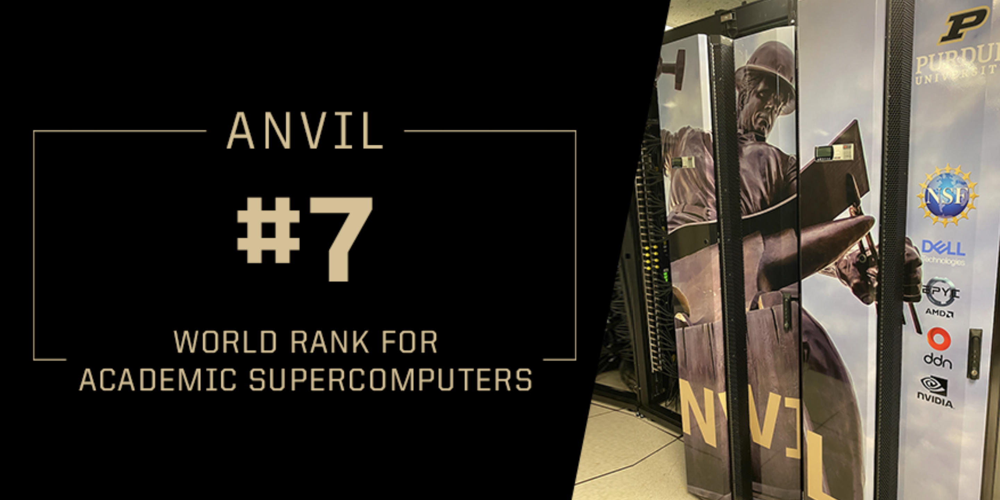

Scientific Applications on Purdue RCAC Clusters and ACCESS Anvil
==============================================

|Anvil| |Negishi|

This is the list of Applications, Compilers, MPIs, NVIDIA NGC containers, and biocontainers deployed on ACCESS `Anvil`_ that is managed by Rosen Center for Advanced Computing (`RCAC`_) clusters at Purdue University.

.. _Anvil: https://www.rcac.purdue.edu/anvil
.. _RCAC: https://www.rcac.purdue.edu
.. _Biocontainers: https://biocontainer-doc.readthedocs.io/en/latest/

.. toctree::
   :maxdepth: 2

   FAQs
   Compilers
   MPIs
   Applications
   Biocontainers
   NGC
